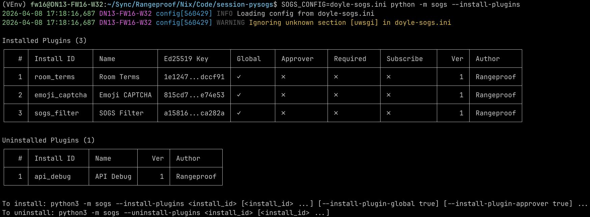

# Plugins

# NOTE: The following is the outdated plugin flow, see Current Work section

PySOGS supports plugins that extend server functionality. Plugins run as separate Python processes and
communicate with PySOGS via OxenMQ, allowing them to filter messages, handle user verification,
respond to events, and more.

## Installation

All plugins follow the same general installation pattern:

### Step 1: Choose a Deployment Method

**Option A: UWSGI Mule (Recommended for Production)**

Add the plugin as a mule in your UWSGI configuration file:

```ini
[uwsgi]
mule = sogs.plugins.<plugin_name>:entry_point
env  = PLUGIN_<PLUGIN_NAME>_INI_PATH=<path/to/config.ini>
```

**Option B: Standalone (Development/Debugging)**

Run the plugin directly as a Python module:

```bash
cd session-pysogs
python3 -m sogs.plugins.<plugin_name> --plugin_<plugin_name>_ini_path <path/to/config.ini>
```

### Step 2: Configure the Plugin

Create or update your `.ini` configuration file with the plugin settings. This can be in your main
PySOGS `.ini` file or a separate file.

At minimum, you need to configure the PySOGS connection in the `[plugin]` section:

```ini
[plugin]
; Your PySOGS public key (found in room URLs)
sogs_pubkey_hex = xxxxxxxxxxxxxxxxxxxxxxxxxxxxxxxxxxxxxxxxxxxxxxxxxxxxxxxxxxxxxxxx

; The OxenMQ address PySOGS is listening on
sogs_address = tcp://127.0.0.1:22028
```

Each plugin has its own configuration section (e.g., `[plugin_emoji_captcha]`) with plugin-specific
settings. See the plugin source files for detailed configuration options.

### Step 3: Enable OxenMQ in PySOGS

Ensure your PySOGS configuration has OxenMQ enabled so plugins can connect:

```ini
[net]
omq_listen = tcp://127.0.0.1:22028
```

### Step 4: Generate Plugin Keys

Start the plugin once (standalone or via UWSGI). On first run, it will generate an Ed25519 keypair
and output the public key:

```
[PLUGIN NAME] Plugin loaded:
  SOGS Address (Pubkey):      tcp://127.0.0.1:22028 (cccc...cccc)
  Display Name:               Plugin Name
  Ed25519 Pubkey:             aaaaaaaaaaaaaaaaaaaaaaaaaaaaaaaaaaaaaaaaaaaaaaaaaaaaaaaaaaaaaaaa
  X25519 Pubkey:              bbbbbbbbbbbbbbbbbbbbbbbbbbbbbbbbbbbbbbbbbbbbbbbbbbbbbbbbbbbbbbbb
  Session Account (Blind-15): 15xxxxxxxxxxxxxxxxxxxxxxxxxxxxxxxxxxxxxxxxxxxxxxxxxxxxxxxxxxxxxxxx
```

### Step 5: Register the Plugin with PySOGS

Use the Ed25519 public key from the previous step to register the plugin:

```bash
python3 -m sogs --add-plugin       <ed25519_pubkey_hex> \
                --plugin-name      'Plugin Name' \
                --plugin-global    true \
                --plugin-approver  true \
                --plugin-required  true \
                --plugin-subscribe true
```

#### Plugin Registration Flags

TODO: Plugins should internally have a name set by the plugin developer which it will shows up as
in the slash menu authoritatively rather than allow users to set this arbitrarily. The plugin should
then register this name on the "hello" handshake.

| Flag | Description |
|------|-------------|
| `--plugin-name` | Name of the plugin to register to the PySOGS instance. Cosmetic only for operator book-keeping |
| `--plugin-global` | When `true`, the plugin is enabled for all rooms on the server. When `false`, the plugin must be explicitly enabled per-room. |
| `--plugin-approver` | When `true`, the plugin will receive notifications for new messages which it can choose to filter, accept or deny the message. |
| `--plugin-required` | When `true`, this plugin must be online, connected to the instance and approve incoming messages. If the plugin is not connected to the PySOGS all messages are rejected until the plugin is connected. Ignored if `approver` is false. |
| `--plugin-subscribe` | When `true`, the plugin receives notifications after messages and reactions are posted from PySOGS. |

#### Per-Room vs Global Registration

**Global registration** (recommended for most plugins):
```bash
python3 -m sogs --add-plugin <pubkey> --plugin-global true
```
The plugin is automatically active in all rooms.

**Per-room registration**:
```bash
# Register plugin without global access
python3 -m sogs --add-plugin <pubkey> --plugin-global false

# Enable for specific rooms
python3 -m sogs --room myroom --add-room-plugin <pubkey>
python3 -m sogs --room anotherroom --add-room-plugin <pubkey>
```
The plugin is only active in explicitly enabled rooms.

## Available Plugins

See the documentation in the plugin file for more detailed configuration options.

### Emoji CAPTCHA

**File:** `sogs/plugins/emoji_captcha.py`

Generates visual CAPTCHA challenges for users joining rooms. Users must react with the correct emoji
shown in an image to gain read/write permissions. Supports configurable retry limits and timeouts.

Requires removing default read/write permissions from rooms:
```bash
sogs --rooms='*' --remove-perms "rw"
```

### SOGS Filter

**File:** `sogs/plugins/sogs_filter.py`

Provides message filtering for profanity and arbitrarily defined alphabets by specifying regex
patterns. Can automatically reject messages or reply with warnings. Supports per-room configuration
overrides and customizable filter responses.

### Room Terms

**File:** `sogs/plugins/room_terms.py`

Presents users with terms of agreement when joining a room. Users must react with an accept emoji
(default: thumbs up) to agree and gain access. Supports per-room terms messages and configurable
retry timeouts.

Requires removing default read/write permissions from rooms:
```bash
sogs --rooms='*' --remove-perms "rw"
```

### API Debug

**File:** `sogs/plugins/api_debug.py`

A development/debugging tool that echoes PySOGS API payloads back to users via whispers. Useful for
understanding the plugin API and debugging plugin development. Provides slash commands for testing
pre/post message handling.

## Current work

Plugins are designed as standalone python modules that mandatorily implement at
minimum the interface see
https://github.com/Doy-lee/session-pysogs/blob/038d8a1537921dd77381422ea814644d197340d0/sogs/plugin.py#L75

```python
# SOGS calls the install_hook function when the user invokes
# python -m sogs --install-plugins <plugin_id>. Here the plugin developer should
# run any interactive installation steps or create any additional files needed for
# the plugin to function.
class InstallPluginMetadata:
    name:             str
    description:      str
    version:          str
    author:           str
    startup_file:     str
    directory:        pathlib.Path
    manifest_path:    pathlib.Path # Path to manifest.ini for the plugin
    sample_ini_path:  pathlib.Path # Path to <install_id>.ini.sample configuration file
    data_dir:         pathlib.Path # Path to data directory where .ini and key files are stored

def install_hook(plugin: sogs.plugin.InstallPluginMetadata) -> sogs.plugin.InstallPluginResult:
```

And optionally the plugin may choose to register one or more of the following
handlers to be notified of the an event respectively see:
https://github.com/Doy-lee/session-pysogs/blob/038d8a1537921dd77381422ea814644d197340d0/sogs/plugin.py#L602

```python
def register_pre_command               (self, command: str, handler: typing.Callable[[RoomAddPostRequest, List[str]], bool]):
def register_post_command              (self, command: str, handler: typing.Callable[[RoomAddPostRequest, List[str]], bool]):
def register_on_request_read_handler   (self, handler: Callable[[RoomReadRequest], bt_value]):
def register_on_reaction_posted_handler(self, handler: Callable[[oxenmq.Message, ReactionPosted], None]):
def register_on_message_posted_handler (self, handler: Callable[[oxenmq.Message, MessagePosted], None]):], pre_command: bool):
def register_pre_command               (self, command: str, handler: typing.Callable[[RoomAddPostRequest, List[str]], bool]):
def register_post_command              (self, command: str, handler: typing.Callable[[RoomAddPostRequest, List[str]], bool]):
```

As standalone modules, plugins communicate with the SOGS using Ed25519-based
encryption via OxenMQ. Hence to authenticate with the server, send requests and
replies through OxenMQ the plugin must maintain its own Ed25519 key pair and
share out-of-band with the SOGS its public key.

The default installation route is to run the plugin on the same machine as the
SOGS and this step managed by SOGS will automatically generate and add the
public key to its database. Installation of a plugin is currently possible by
invoking:

```
python -m sogs --install-plugins   [install_ids...]
python -m sogs --uninstall-plugins [install_ids...]
```

Which brings up a listing of installable plugins and un-installable plugins if
no additional arguments are passed in such as:



It does this by iterating the `sogs/plugins folder`, reading the `manifest.ini`
in each subfolder and populating the table as well as scanning the DB for the
list of currently installed plugins. Work remains to move the plugins out of the
repository to allow sourcing from any arbitrary repository of plugins such as
a community maintained repository. `plugins.md` is outdated and references the
old method of installation.

Plugins are installed into a single directory governed by the new config
variable `data-dir` in the .ini config file and defaults to
`./sogs-data/plugins/<plugin_id>` (future work would also look to moving the
SOGS keypair into this directory as well as the database file if SQLite is
chosen as the backend).

Installing involves, instantiating the template `<plugin_install_id>.sample.ini`
file that every plugin ships with into the data-dir, generating Ed25519 key
pairs and writing the public key pair into the database. Plugins implement one
function, the `install_hook` where they can interactively prompt the user if there
are options to customise for the plugin.

For example, the layout of the `api_debug` plugin is

- `__init__.py` exports the functions into the package (e.g. from .api_debug import
entry_point, install_hook
- `<install_id>.ini.sample` the sample .ini file that will be instantiated into
data-dir
- `manifest.ini` file that exposes plugin metadata for un/installation

```
> session-pysogs$ ls -lash sogs/plugins/api_debug/
total 40K
4.0K drwxr-xr-x 3 fw16 fw16 4.0K Apr  8 11:06 .
4.0K drwxr-xr-x 7 fw16 fw16 4.0K Apr  8 11:06 ..
4.0K -rw-r--r-- 1 fw16 fw16   48 Apr  8 11:06 __init__.py
4.0K drwxr-xr-x 2 fw16 fw16 4.0K Apr  8 16:56 __pycache__
4.0K -rw-r--r-- 1 fw16 fw16  420 Apr  8 11:06 api_debug.ini.sample
4.0K -rw-r--r-- 1 fw16 fw16 2.7K Apr  8 11:06 api_debug.md
 12K -rw-r--r-- 1 fw16 fw16  12K Apr  8 11:06 api_debug.py
4.0K -rw-r--r-- 1 fw16 fw16  187 Apr  8 11:06 manifest.ini
```

An example of installing the api_debug plugin looks like:

```
> session-pysogs$ SOGS_CONFIG=sogs.ini python -m sogs --install-plugins api_debug
2026-04-09 10:27:34,210 config[2662] INFO Loading config from doyle-sogs.ini
2026-04-09 10:27:34,210 config[2662] WARNING Ignoring unknown section [uwsgi] in doyle-sogs.ini
Installing API Debug...
  Loading Ed25519 key from sogs-data/plugins/api_debug/api_debug_ed25519 ... public: b83b95c6e220fb9a9ff7df690b948aa709662f4d49acf461b64cd45a35671d33
  Deriving X25519 key ... public: 01bc00ab07a771ea4ce9cc98e59086767bee8dc2615f15ac2837d3b511343120
  Running plugin installer ...
  Registering plugin in SOGS instance ...
  Plugin installed:
    Install ID: 'api_debug'
    Name:       'API Debug'
    Global:     False
    Approver:   False
    Required:   False
    Subscribe:  False
```

Ideally, there should be a path to allow non-interactive installation and an
interactive installation flow, so all options must be specifiable by the command
line, or some input config file if the operator wishes, or they can go through
the interactive flow. The operator should be able to re-run the install step on
already-installed plugins if they wanted a TUI to reconfigure their plugin.

For plugins, there’s a strong emphasis on making the experience for user
friendly to encourage a large diaspora of operators and communities to gather on
Session.

The current branch with the work-in-progress plugin work is here
https://github.com/Doy-lee/session-pysogs/tree/doyle-plugin-installers. As well
in this branch we have contrib/local-dev-environment-setup.shwhich downloads all
the dependencies at their exact hashes that is capable of running pysogs into
the current working directory, builds and installs them into a python virtual
environment. This script also needs updating to use the latest iterations of the
respective libraries.

At some point libsession’s 25-blinding APIs changed, perhaps, the order of
arguments in a way that was still ABI compatible that causes plugin registration
of its own Ed25519 public key to fail and hence pysogs is still reliant on
fairly old versions of the tech-stack.
